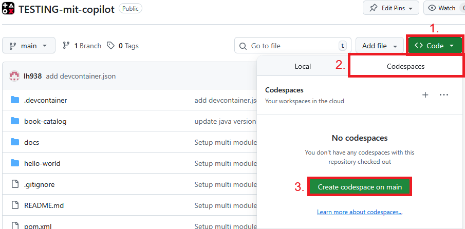

# Modul book-catalog – Testing-Workshop

## Hintergrund
Das Projekt simuliert eine Backend-Anwendung zur Verwaltung eines Buchkatalogs. Diese Anwendung hat bewusst so gut wie keine Testabdeckung, um als Grundlage für den Workshop zu dienen.

**Kontext:**
- Verwaltung von Büchern und Buchreihen
- REST-API für zentrale Buchabfrage, Filterung, Hinzufügen/Löschen
- Direkter Datenbankzugriff (H2 In-Memory)

---

## Projektstruktur

```plaintext
book-catalog/
└── src/
    ├── main/
    │   ├── java/
    │   │   └── com/example/
    │   │       ├── controller/
    │   │       │   ├── BookController.java         // REST-Endpunkte für Bücher (CRUD, Listen, Suchen)
    │   │       │   └── SeriesController.java       // REST-Endpunkte für Buchreihen (CRUD, Listen)
    │   │       ├── dto/
    │   │       │   ├── BookDTO.java                // Daten-Transfer-Objekt für Buchdaten (zur Kommunikation über die API)
    │   │       │   └── SeriesDTO.java              // Daten-Transfer-Objekt für Buchreihen (zur Kommunikation über die API)
    │   │       ├── model/
    │   │       │   ├── Book.java                   // Domänenmodell/Entity für ein Buch
    │   │       │   └── Series.java                 // Domänenmodell/Entity für eine Buchreihe
    │   │       ├── repository/
    │   │       │   ├── BookRepository.java         // Datenbankzugriff für Bücher (CRUD Operationen)
    │   │       │   └── SeriesRepository.java       // Datenbankzugriff für Buchreihen (CRUD Operationen)
    │   │       ├── service/
    │   │       │   ├── BookService.java            // Geschäftslogik für Bücher (z.B. Validierungen)
    │   │       │   ├── PriceCalculator.java        // Hilfsklasse für Preisberechnung von Büchern/Buchreihen
    │   │       │   └── SeriesService.java          // Geschäftslogik für Buchreihen (z.B. Zusammenstellung von Serien)
    │   │       ├── AppConfig.java                  // Grundkonfiguration für die Spring-Anwendung
    │   │       └── BookCatalogApplication.java     // Startpunkt der Anwendung (Spring Boot Application)
    │   └── resources/
    │       ├── application.properties              // Zentrale Konfiguration der Anwendung (z.B. Port, DB-Zugang)
    │       ├── data.sql                            // Initiale Testdaten für die Datenbank
    │       └── schema.sql                          // Datenbankschema (Tabellenstruktur)
    └── test/
        └── java/
            └── com/example/
                // (Beispielhafte Tests vorhanden, jedoch lückenhaft und verbesserungsfähig)
```
---

## Ziel des Workshops

- **Testlücken erkennen:** Analysiere gemeinsam mit Github Copilot, an welchen Stellen im Projekt Tests fehlen, oberflächlich oder fehlerhaft sind.
- **Tests verbessern:** Entwickle robuste, aussagekräftige und wartbare Unittests. Nutze dafür die Unterstützung von Copilot zur Testgenerierung, -erweiterung und Reorganisation.
- **Testabdeckung steigern:** Verwende Tools zur Testabdeckungsanalyse, um Verbesserungen sichtbar und messbar zu machen.

---

## Tipps und Tricks

### Codespace öffnen
Github Codespace kann wie im Screenshot gezeigt geöffnet werden:  
  

### Hinweise

- **Schrittweise vorgehen:** Starte mit dem Testen einzelner Methoden, bevor du ganze Komponenten angehst.
- **Kontext bereitstellen:** Beschreibe, was die Methode/Klasse tut und welche Randbedingungen zu testen sind.
- **Nach Testideen fragen:** "`Welche kritischen Testfälle sollte ich für BookService.java abdecken?`"
- **Teste auch Fehlerfälle:** Lass KI Szenarien vorschlagen, bei denen bewusste Fehler auftreten sollten.
- **Lasse die Tests gut lesbar dokumentieren:** Testmethoden sinnvoll benennen (`shouldThrowException_forInvalidPrice`).
- **Fasse abgedeckte und nicht abgedeckte Stellen zusammen:** Lass dir auflisten, wo noch Tests fehlen könnten.
- **Teste die Github Copilot Befehle:** z.B. \tests

### Hilfestellung
Experimentiere gerne frei mit Prompts, um gezielt Testfälle zu generieren oder bestehende Tests zu überarbeiten. Alternativ kannst du die Vorschläge und Prompts in [hilfestellung](docs/hilfestellung.md) nutzen.

---

**Viel Erfolg beim Testen!**